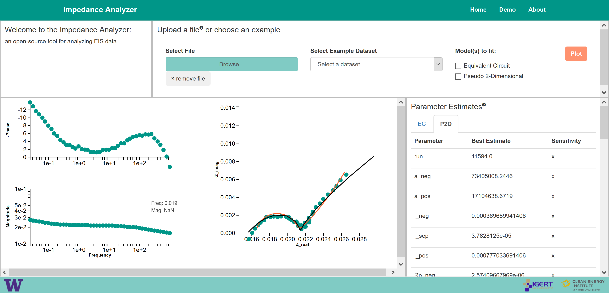

# Impedance Analyzer

The ImpedanceAnalyzer is an open-source, web-based analysis platform aimed at making physics-based models as easy to use as equivalent circuits for the analysis of experimental EIS spectra. *These tools are currently under development and contributions, suggestions, and feedback are really appreciated!* (contact: mmurbach `at` uw `dot` edu)

This repository contains all of the code for the [Impedance Analyzer](http://theimpedanceanalyzer.com) currently running using Elastic Beanstalk on Amazon Web Services.

**Documentation:** [ReadTheDocs](http://impedanceanalyzer.readthedocs.io/en/latest/)

The requirements.txt file can be used to recreate the same conda environment with the following commands:

    > conda create -n impedance-analyzer-env
    > conda install scipy pandas
    > pip install -r requirements.txt

And then the ImpedanceAnalyzer can be run locally using either:

    > ./start.bat

or

    > source activate impedance-analyzer-env
    > python application.py

The application should then be running locally at: http://localhost:5000
